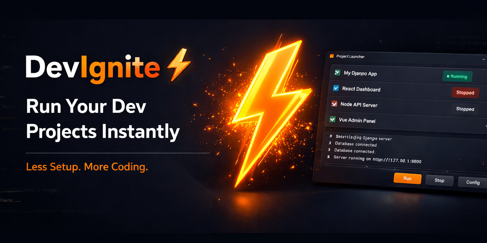
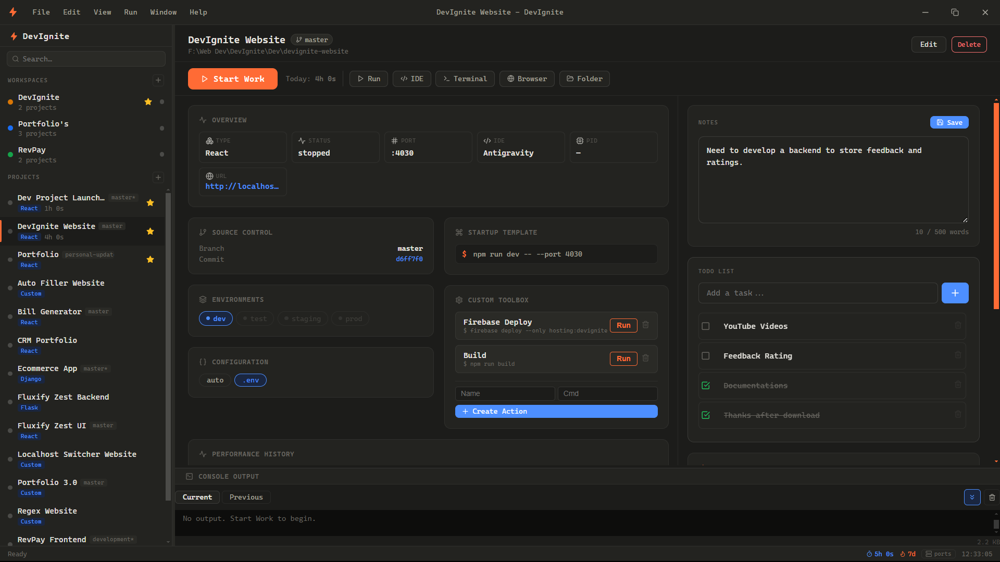
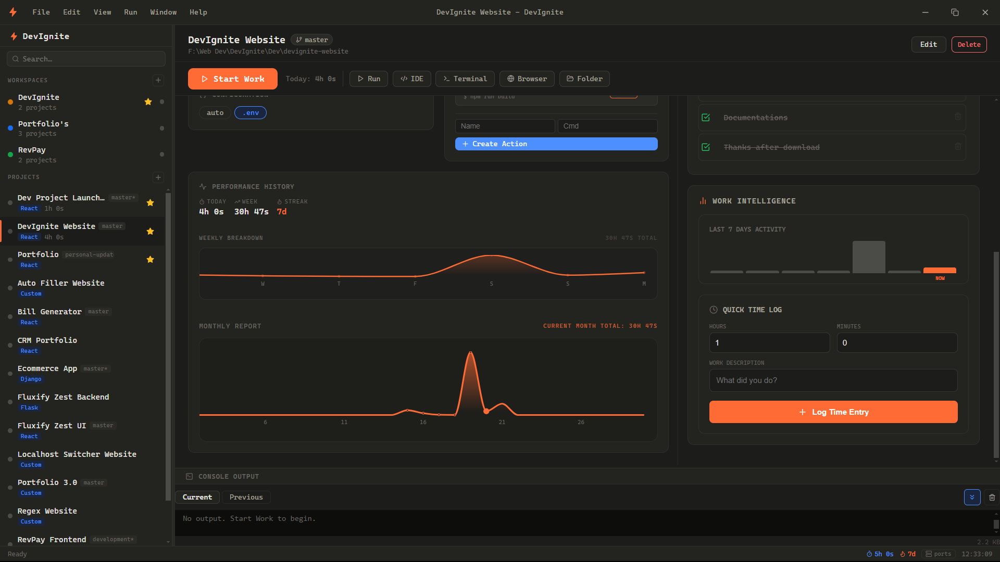

<div align="center">

<!-- Replace with your actual banner image -->
<!-- Suggested: assets/banner.png — a dark-themed 1280×640 banner with the DevIgnite logo and tagline -->


<h1>⚡ DevIgnite</h1>

<p><strong>One click to ignite your entire dev environment.</strong><br/>
Open IDE · Launch terminal · Run startup commands · Track time · Open browser — all at once.</p>

[](https://github.com/vsmidhun21/DevIgnite/releases)
[](https://github.com/vsmidhun21/DevIgnite)
[](https://www.electronjs.org/)
[](https://react.dev/)
[](https://github.com/WiseLibs/better-sqlite3)
[](LICENSE)

<br/>

<!-- Suggested: assets/screenshot-main.png — full app screenshot (dark mode) at ~1280×800 -->



</div>

---

## Table of Contents

- [Why DevIgnite?](#why-devignite)
- [Features](#features)
- [Tech Stack](#tech-stack)
- [Getting Started](#getting-started)
  - [Prerequisites](#prerequisites)
  - [Installation](#installation)
  - [Development](#development)
  - [Build for Production](#build-for-production)
- [Architecture](#architecture)
- [Project Configuration](#project-configuration)
- [Keyboard & UI Concepts](#keyboard--ui-concepts)
- [Database](#database)
- [Supported Project Types](#supported-project-types)
- [Supported IDEs](#supported-ides)
- [Contributing](#contributing)
- [Roadmap](#roadmap)
- [License](#license)

---

## Why DevIgnite?

Every developer has a ritual when starting work on a project: open the IDE, fire up a terminal, `cd` into the directory, activate the virtualenv, run the server, open the browser at `localhost:3000`... It's repetitive, error-prone, and fragmented across tools.

**DevIgnite collapses that entire ritual into a single button press.**

It's a local desktop app — no cloud, no account, no telemetry. Your projects, your machine, your data.

---

## Features

<!-- Suggested: assets/screenshot-startwork.gif — short screen recording of clicking "Ignite" and watching everything launch -->

| | Feature | Description |
|---|---|---|
| ⚡ | **Start Work** | One-click launches IDE, terminal, startup commands, and browser |
| 🔢 | **Multi-step Startup** | Define ordered startup steps (blocking or background) per project |
| ⏱️ | **Time Tracking** | Automatic session logging, daily streaks, and productivity charts |
| 🌿 | **Git Status** | Live branch name, dirty indicator, ahead/behind counts in the sidebar |
| 🌍 | **Env Management** | Per-project `.env` switching (dev / test / staging / prod) |
| 🏢 | **Workspaces** | Group projects and start/stop all of them with one click |
| 🔌 | **Port Manager** | Detects conflicts before launch — kill, increment, or cancel |
| 📋 | **Log Viewer** | Real-time streamed logs with current/previous session tabs |
| 🔍 | **Auto Detection** | Detects project type, default command, port, and IDE from the filesystem |
| 🖥️ | **IDE Aware** | Scans your system for installed IDEs and lets you pick per project |

---

## Tech Stack

| Layer | Technology | Version |
|---|---|---|
| Runtime | [Electron](https://www.electronjs.org/) | ^29.0.0 |
| Build | [Electron Forge](https://www.electronforge.io/) + [Vite](https://vitejs.dev/) | ^7.11.1 / ^5.4.21 |
| UI | [React](https://react.dev/) | ^18.2.0 |
| Icons | [lucide-react](https://lucide.dev/) | ^0.344.0 |
| Database | [better-sqlite3](https://github.com/WiseLibs/better-sqlite3) | ^9.6.0 |
| IDs | [uuid](https://github.com/uuidjs/uuid) | ^9.0.0 |

---

## Getting Started

### Prerequisites

- **Node.js** 18+ (LTS recommended)
- **npm** 9+
- **Windows**: [Visual C++ Build Tools](https://visualstudio.microsoft.com/visual-cpp-build-tools/) — required to compile `better-sqlite3` native bindings

> **macOS / Linux users:** Build Tools are not required. Xcode Command Line Tools (macOS) or `build-essential` (Linux) are sufficient.

### Installation

```bash
git clone https://github.com/vsmidhun21/DevIgnite.git
cd DevIgnite
npm install
```

### Development

```bash
npm start
```

Launches the app with hot reload and DevTools open. Vite serves the renderer on a local dev server; Electron loads it automatically.

### Build for Production

```bash
npm run make
```

Produces `out/make/squirrel.windows/x64/DevIgniteSetup.exe` on Windows (`.dmg` / `.deb` on other platforms via the respective Forge makers).

> **Important build rules — do not modify these without understanding the consequences:**
> - `"type": "module"` must **not** be present in `package.json` — Electron Forge's Vite plugin requires CJS.
> - `"main"` must be `".vite/build/main.js"`, not `src/main.js`.
> - Use `better-sqlite3` **v9.6.0** with Electron **v29** — newer combinations require VS Build Tools on Windows and may hang during `make`.

---

## Architecture

DevIgnite is divided into three layers with strict separation of concerns:

```
devignite/
├── core/               # Pure Node.js business logic — no Electron imports
│   ├── db/             # SQLite + migrations
│   ├── execution-manager/  # START WORK orchestrator
│   ├── git-service/    # Branch, hash, dirty, ahead/behind
│   ├── project-manager/    # CRUD + SQL
│   ├── time-tracker/   # Sessions, streaks, stats
│   ├── port-manager/   # TCP probe, netstat, kill
│   ├── env-manager/    # .env detection + parsing
│   ├── ide-detector/   # System IDE scan
│   ├── log-manager/    # File-based log rotation
│   └── ...
│
├── shared/             # Constants shared between main and renderer
│   └── constants/index.js   # IPC channel names, defaults
│
└── src/
    ├── main.js         # Electron main process — 40 ipcMain handlers
    ├── preload.js      # contextBridge API exposed as window.devignite
    ├── App.jsx         # Root state + routing
    └── components/     # All React UI components
```

**Design principle:** `core/` has zero Electron dependencies and is designed to be reusable from a CLI in the future. All Electron–renderer communication goes through typed IPC channels defined in `shared/constants`.

<!-- Suggested: assets/architecture-diagram.png — a simple layered diagram: Renderer → preload bridge → IPC → main.js → core/ → SQLite -->

---

## Project Configuration

Each project stores:

| Setting | Description |
|---|---|
| `name` / `path` | Display name and absolute path |
| `type` | Auto-detected or manually set (Django, React, etc.) |
| `command` | Single run command (used if no startup steps defined) |
| `startup_steps` | JSON array of ordered steps with `label`, `cmd`, `wait` |
| `ide` / `ide_path` | Selected IDE and optional custom executable path |
| `port` / `url` | Dev server port and browser URL to open |
| `active_env` | Active environment (`dev` / `test` / `staging` / `prod`) |
| `open_terminal` | Whether to open a terminal on Start Work |
| `open_browser` | Whether to open the browser after server starts |
| `install_deps` | Whether to auto-run install before startup |

### Startup Steps

```json
[
  { "label": "Install deps",   "cmd": "pip install -r requirements.txt", "wait": true },
  { "label": "Run migrations", "cmd": "python manage.py migrate",        "wait": true },
  { "label": "Start server",   "cmd": "python manage.py runserver",      "wait": false }
]
```

- `wait: true` — blocking step; must exit 0 before the next step runs.
- `wait: false` — background process (your long-running server).
- Empty array `[]` — falls back to the single `command` field.

---

## Keyboard & UI Concepts

- **Ignite button** — the primary Start Work CTA. Turns red and shows a live timer while the project is running.
- **Env tabs** — `dev` is always active. `test` / `staging` / `prod` are enabled only if a matching `.env.*` file exists in the project folder.
- **Port flyout** — the status bar shows all listening ports in the `3000–9999` range, matched to your projects by port number.
- **Modals** — do not close on outside click. This is intentional to prevent accidental data loss.

---

## Database

DevIgnite uses a local SQLite database. No data ever leaves your machine.

- **Location:** `%APPDATA%\devignite\devignite.sqlite` (Windows) / `~/Library/Application Support/devignite/` (macOS)
- **Mode:** WAL (Write-Ahead Logging) for safe concurrent reads
- **Migrations:** Fully incremental — `CREATE TABLE IF NOT EXISTS` + safe `ALTER TABLE` on every launch

**Tables:** `projects`, `sessions`, `groups`

---

## Supported Project Types

| Type | Default Command | Default Port |
|---|---|---|
| Django | `python manage.py runserver` | 8000 |
| Flask | `flask run` | 5000 |
| FastAPI | `uvicorn main:app --reload` | 8001 |
| React | `npm start` | 3000 |
| Next.js | `npm run dev` | 3000 |
| Angular | `ng serve` | 4200 |
| Vue | `npm run dev` | 5173 |
| Nuxt | `npm run dev` | 3000 |
| Laravel | `php artisan serve` | 8080 |
| Spring Boot | `mvn spring-boot:run` | 8080 |
| Node.js | `node index.js` | 3001 |
| Python | `python main.py` | — |
| Custom | *(user defined)* | — |

Auto-detection scans for signal files (`manage.py`, `package.json`, `pom.xml`, etc.) and pre-fills all defaults.

---

## Supported IDEs

DevIgnite scans your system PATH and common install directories to find available IDEs:

VS Code · Cursor · Windsurf · Zed · IntelliJ IDEA · PyCharm · WebStorm · Rider · CLion · Sublime Text · Vim / Neovim · Notepad++

A custom executable path can be set per-project for any IDE not auto-detected.

---

## Contributing

Contributions are welcome. Please open an issue first to discuss what you'd like to change.

```bash
# 1. Fork the repo and clone your fork
git clone https://github.com/YOUR_USERNAME/DevIgnite.git
cd DevIgnite

# 2. Install dependencies
npm install

# 3. Create a feature branch
git checkout -b feat/your-feature-name

# 4. Start the dev server
npm start

# 5. Commit and push, then open a PR against main
```

**A few conventions to keep in mind:**

- `core/` must remain Electron-free. All Node built-ins are fine; `electron` is not.
- All IPC channel names live in `shared/constants/index.js` — do not hardcode strings in `main.js` or components.
- Do not add `"type": "module"` to `package.json`.

---

## Roadmap

- [ ] Settings page — theme toggle, default IDE, global startup behavior
- [ ] Project sorting — by name / type / last run / time today
- [ ] System tray notifications on start/stop
- [ ] Squirrel auto-updater
- [ ] Import / export projects as JSON backup
- [ ] CLI interface (reusing `core/` directly)

---

## License

[MIT](https://github.com/vsmidhun21/DevIgnite/blob/master/LICENSE) © 2026 [Midhun V S](https://github.com/vsmidhun21)

---

<div align="center">
  <sub>Built with ⚡ by <a href="https://vsmidhun21.github.io">Midhun V S</a> &nbsp;·&nbsp; <a href="https://github.com/vsmidhun21/DevIgnite/issues">Report a bug</a> &nbsp;·&nbsp; <a href="https://github.com/vsmidhun21/DevIgnite/issues">Request a feature</a></sub>
</div>